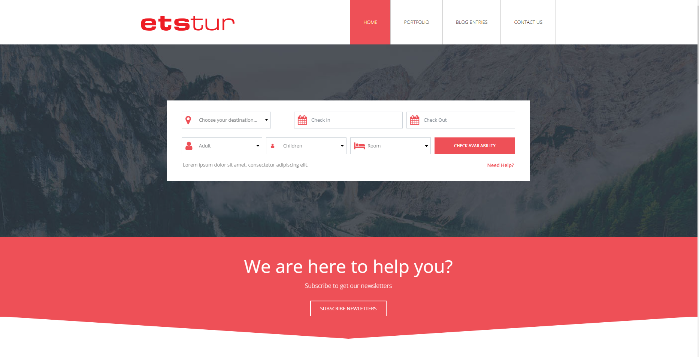
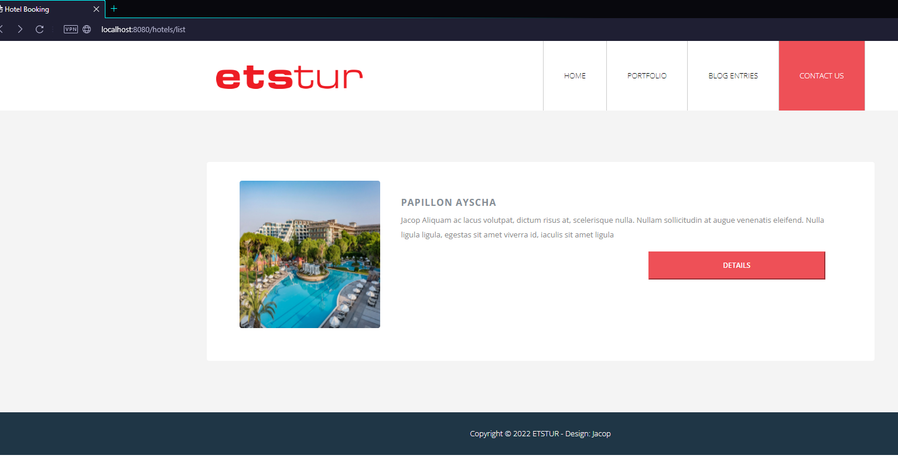
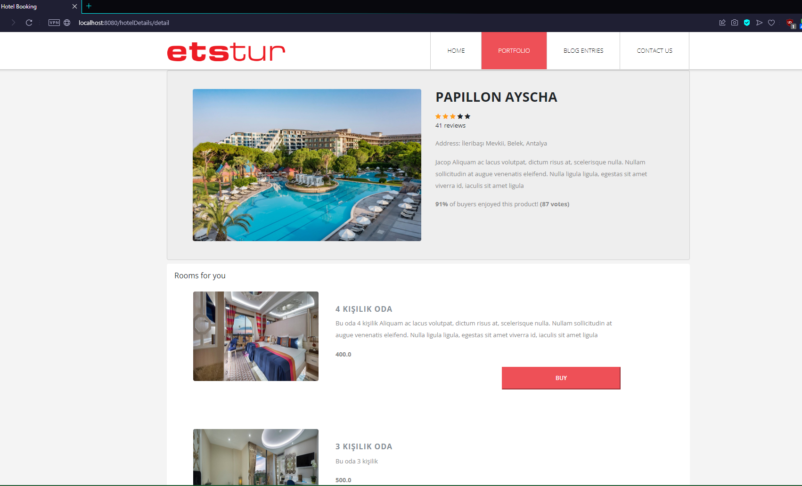
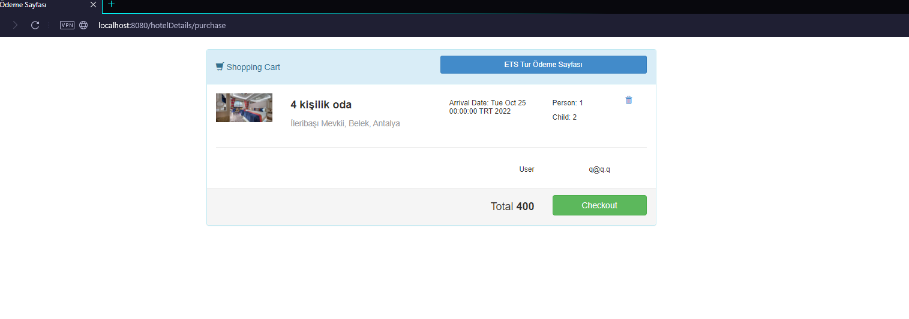
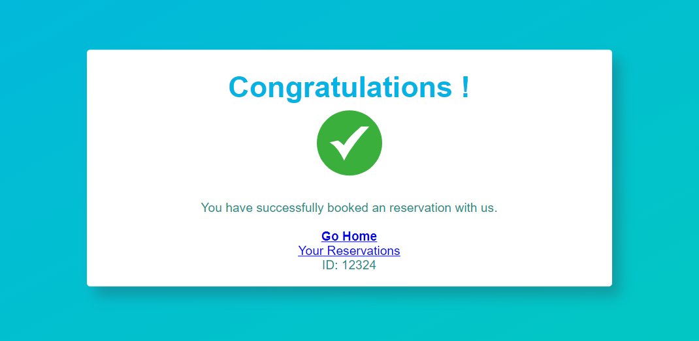
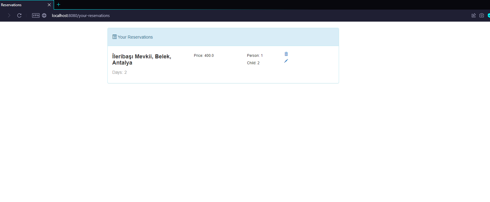
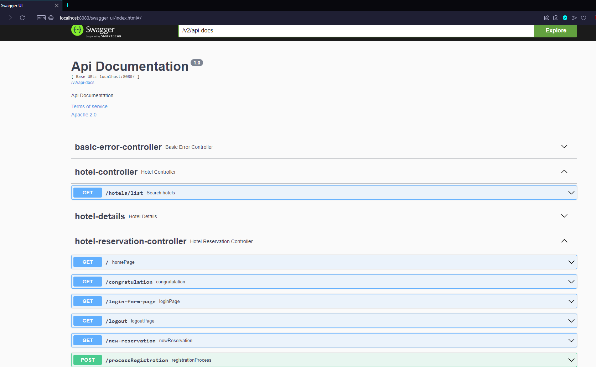

# Jacop's  Hotel Reservation


## API Kullanımı

#### Edit Reservation
```http
  GET /swagger-ui/index.html
```
| Açıklama                |
 | :------------------------- |
 | /v2/api-docs  seçilmelidir|


#### Tüm öğeleri getir

```http
  GET /
```

| Açıklama                |
 | :------------------------- |
 | Authentication, Login Required . |

#### Detination'a göre Hoteller

```http
  GET /hotels/list
```

| Parametre | Tip     | Açıklama                       |
| :-------- | :------- | :-------------------------------- |
| `destination`      | `string` | **Gerekli**. Varış adresi |
| `check-in`      | `string` | **Gerekli**. Varış tarihi |
| `check-out`      | `string` | **Gerekli**. Varış tarihi |
| `adultCount`      | `int` | **Gerekli**. Yetişkin sayısı |
| `childCount`      | `int` | **Gerekli**. Çocuk sayısı |
| `roomCount`      | `int` | **Gerekli**. Oda sayısı |


#### İlgili Hotel'in odaları

```http
  GET /hotelDetails/detail
```

| Parametre | Tip     | Açıklama                       |
| :-------- | :------- | :-------------------------------- |
| `myHotel`      | `Hotel` | **Gerekli**. Hotel bilgisi |


  
#### İlgili Hotel'in odaları

```http
  GET /hotelDetails/purchase
```

| Parametre | Tip     | Açıklama                       |
| :-------- | :------- | :-------------------------------- |
| `myRoom`      | `Room` | **Gerekli**. Oda bilgisi |


* Checkout denilince ilgili bankanın satın alma sayfasına gidip başarılı ödeme yaptığını varsayıyoruz.


#### Tebrikler sayfası 
```http
  GET /congratulation
```

#### Your Reservations
```http
  GET /your-reservations
```
* Aktif kullanıcının id değerine göre veritabanından reservationlar getirilir


#### Delete Reservation
```http
  GET /reservation-delete
```
| Parametre | Tip     | Açıklama                       |
| :-------- | :------- | :-------------------------------- |
| `id`      | `int` | **Gerekli**. Reservation id |


#### Edit Reservation
```http
  GET /reservation-edit
```
| Parametre | Tip     | Açıklama                       |
| :-------- | :------- | :-------------------------------- |
| `id`      | `int` | **Gerekli**. Reservation id |


## Screees

#### Home Page


#### Hotel List



#### Room List



#### Purchase 



#### Success Payment 


#### Your Reservations



#### Swagger UI



